# 組み立てガイド

## 1. 必要なもの

* はんだ付けセット
* 接着剤
* プラスドライバー
* 各種部品([PartsList](./PartsList.md)参照)

---

## 2. 組み立て手順

### Step 1: 基板（PCB）への部品実装と配線
部品と導線のはんだ付けを行います。  
LRボタン用基板は表裏を間違えやすいです。GNDの印字がない方にスイッチの押す部分がきます。

  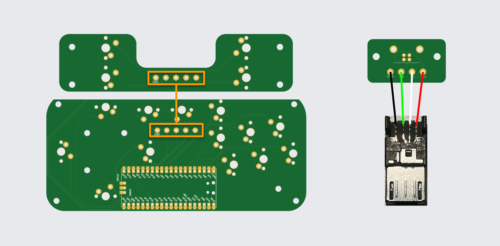
  
配線図
 

  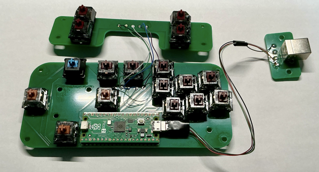
  
はんだ付けが完了した基板
 

### Step 2: GP2040-CEのインストール
GP2040-CEをインストールします。すべてのボタンが動くことを確認してピンマッピングの設定を行います。

  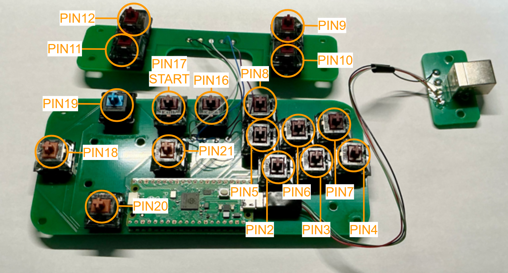
  
ピンマッピング
 

### Step 3: スティックの組み立て
①スティックの土台のパーツ(StickBase)にナットを、軸のパーツ(StickAxis)に磁石を接着剤でつけ組み合わせます。  
②スティックの土台の欠けている部分を右下にして、横方向にパーツ(StickHorizontal)をはめ込みます。  
③残りのパーツ(StickVertical)をはめ込みます。  
④スティックの頭のパーツ(StickHead)に軸につけた磁石と引き合うように磁石を接着します。これは今は組み合わせずに本体を組み立てた後にはめ込みます。  
これでスティックは完成です。3Dプリントのばらつきやバリによって滑らかに動かないときはやすり等で調整します。

  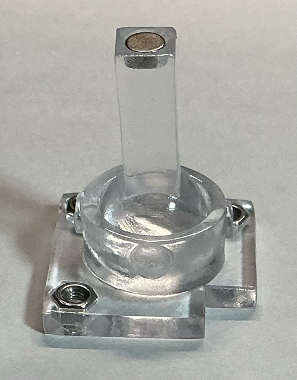
  
スティック組み立て①
 

  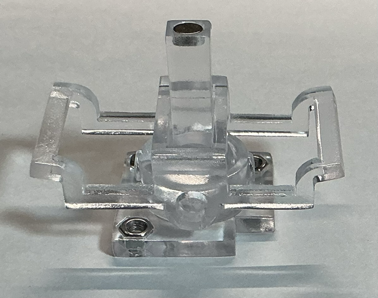
  
スティック組み立て②
 

  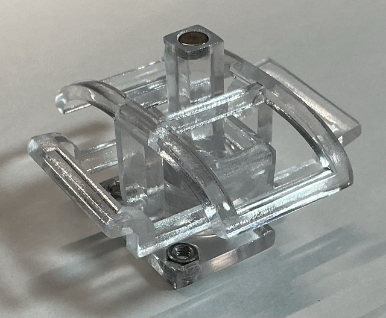
  
スティック組み立て③
 

  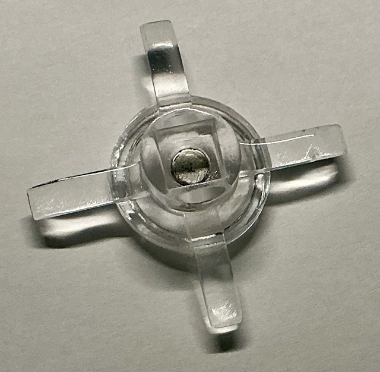
  
スティック組み立て④
 

### Step 4: 本体の組み立て
①本体前面(Front)にナットを接着します。  
②本体背面(Back)とはんだ付けした基板を組み合わせてねじとナットで固定します。  
③ボタンパーツをキースイッチにはめ込みます。パーツが大きめなので接着剤かマスキングテープなどシート状のものを噛ませてはめ込むことで固定します。  
④本体背面と前面を組み合わせてねじとナットで固定します。  
⑤端子がついている面から基板をねじで固定します。  
⑥スティックの頭をはめ込んで完成です

  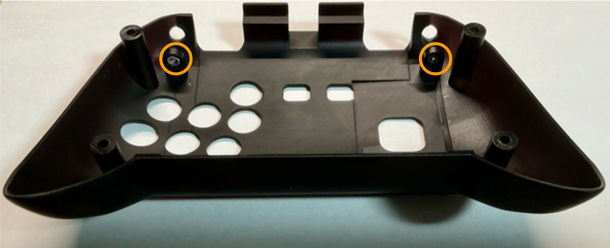
  
本体組み立て①
 

  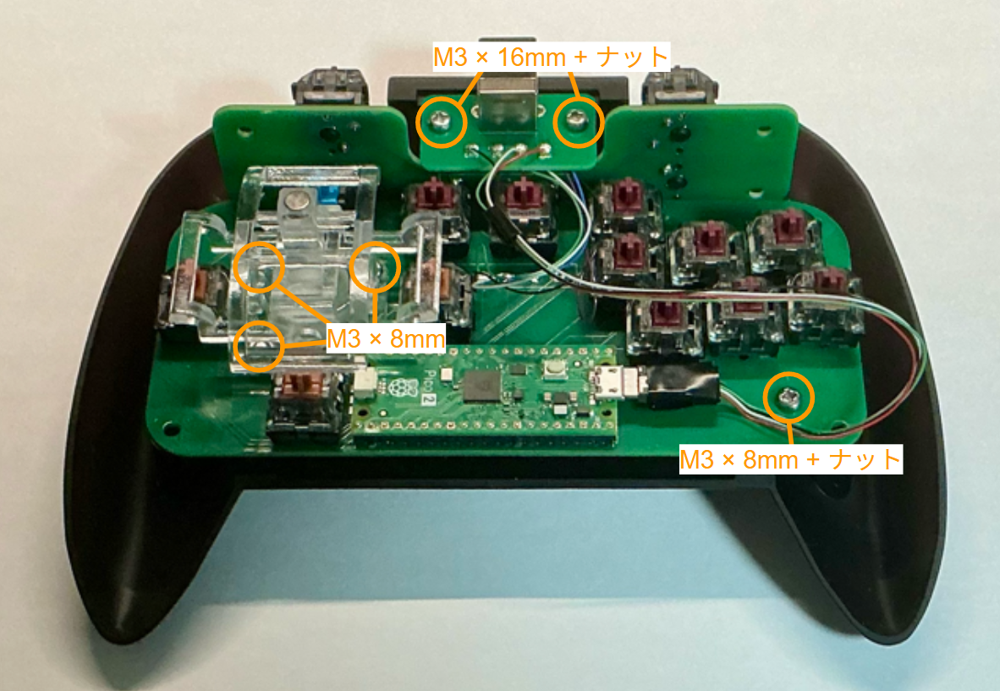
  
本体組み立て②
 

  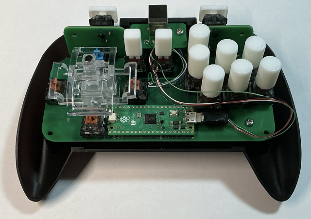
  
本体組み立て③
 

  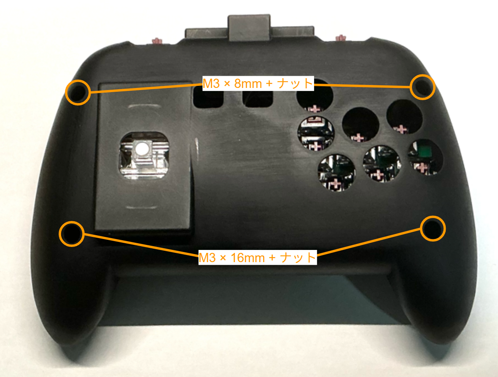
  
本体組み立て④
 

  

  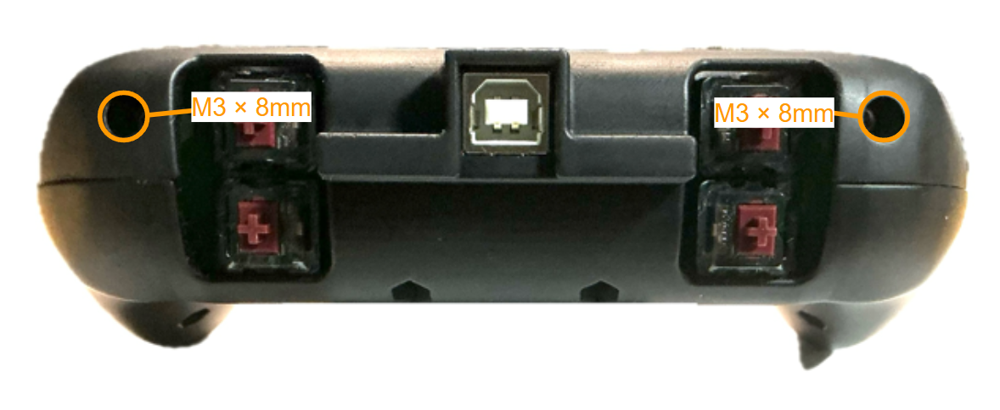
  
本体組み立て⑤
 

  
  
本体組み立て⑥
 
