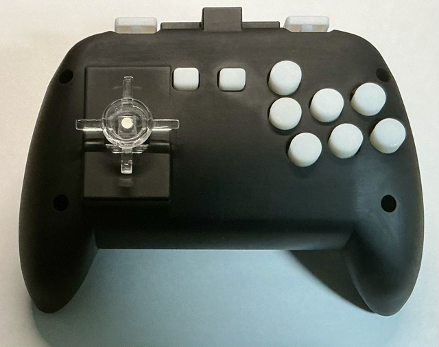

# Custom Fighting Game Gamepad
ストリートファイター６用の自作ゲームパッドです。  
スティックの上入力を無効化できるものが欲しくて作りました。  
Raspberry Pi PicoにGP2040-CEをインストールして使います。  
素人設計なので拙い部分が多々あると思います。データを利用する場合は自己責任でお願いします。

## ライセンス (License)

本プロジェクトのすべてのデータは、以下のライセンスの下で提供されています。

**クリエイティブ・コモンズ 表示 - 非営利 - 継承 4.0 国際 ライセンス (CC BY-NC-SA 4.0)**

You are free to:  
- Share — copy and redistribute the material in any medium or format  
- Adapt — remix, transform, and build upon the material  
The licensor cannot revoke these freedoms as long as you follow the license terms.  
  
Under the following terms:  
- Attribution — You must give appropriate credit, provide a link to the license, and indicate if changes were made. You may do so in any reasonable manner, but not in any way that suggests the licensor endorses you or your use.  
  
- NonCommercial — You may not use the material for commercial purposes.  
  
- ShareAlike — If you remix, transform, or build upon the material, you must distribute your contributions under the same license as the original.  
  
- No additional restrictions — You may not apply legal terms or technological measures that legally restrict others from doing anything the license permits.  